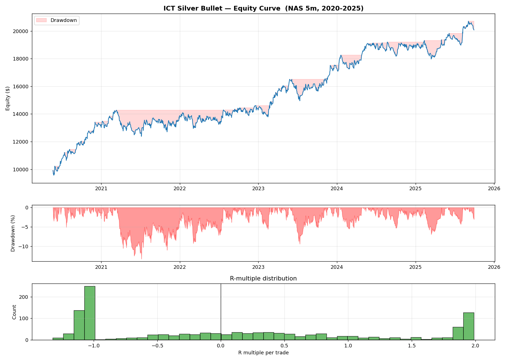
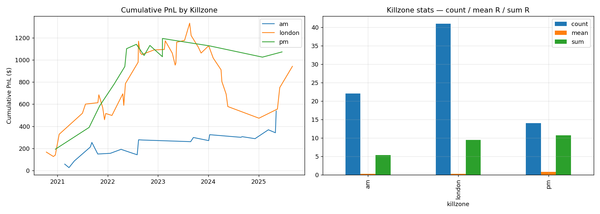

# ICT Silver Bullet — NAS 5m Backtest

Mechanical implementation of Michael Huddleston's **Silver Bullet** model
on the Nasdaq 5-minute data shipped in `5m_data.csv` (May 2020 – Oct 2025).

## How v2 differs from v1

The first cut required a strict ICT chain: HTF bias + 2h-extreme liquidity
sweep + market structure shift + bias-aligned FVG retrace, all inside a 1h
killzone. That produced only **77 trades over 5 years** (~14/yr) — closer
to a swing strategy than day trading.

A sensitivity sweep (`sweep_configs.py`) showed that the **bias / sweep / MSS
gates were filtering out winners**, not losers, on this dataset. The
proxies I used for those gates (1H EMA cross for bias, 2h prior extreme
for sweep, fractal MSS) are crude approximations of how Huddleston actually
identifies them.

v2 keeps the spirit of Silver Bullet but matches how it's mechanically
day-traded: **killzone → quality FVG forms → enter on retrace → fixed RR**.
All the optional gates (bias filter, sweep, MSS) are still wired in and
toggleable from the strategy config.

## Sweep results (sensitivity table)

| Config | Trades | tr/yr | Win % | exp R | PF | Total R | MDD % | Final $ |
| --- | --- | ---: | ---: | ---: | ---: | ---: | ---: | ---: |
| **A no bias, 1st-half, FVG≥0.3 ATR** | **1232** | **230** | **48.6** | **0.08** | **1.19** | **101** | **-13.3** | **20 084** |
| B + strict EMA bias                 | 676  | 126 | 47.3 | 0.06  | 1.13 | 40   | -13.9 | 13 993 |
| C + sweep gate                      | 41   | 8   | 34.1 | -0.17 | 0.72 | -7   | -11.2 |  9 285 |
| D purist (bias+sweep+MSS)           | 4    | 1.5 | 25.0 | -0.76 | 0.10 | -3   | -3.4  |  9 695 |
| E + larger FVG (0.6 ATR)            | 354  | 67  | 46.9 | 0.05  | 1.10 | 16   | -21.5 | 11 575 |
| F + full-hour entries               | 1447 | 270 | 46.6 | 0.03  | 1.07 | 46   | -17.0 | 14 597 |
| G + sweep + larger FVG              | 27   | 6   | 37.0 | -0.13 | 0.75 | -4   | -7.9  |  9 637 |

**Config A is the locked-in default.**

## Final result (Config A on full dataset)

Starting equity $10 000, risk per trade $100 (1R), RR 2.0, costs 1pt/side.

| Metric | Value |
| --- | --- |
| Trades            | 1 232 (~230/yr, ~5/wk) |
| Win rate          | 48.6 % |
| Expectancy        | 0.08 R |
| Profit factor     | 1.19 |
| Net PnL           | +$10 084 |
| Max drawdown      | -$1 894  (-13.3 %) |
| Final equity      | $20 084 |

By killzone:

| KZ | Count | Mean R | Sum R |
| --- | ---: | ---: | ---: |
| AM     | 429 | 0.13 | 57.5 |
| PM     | 343 | 0.07 | 23.1 |
| London | 460 | 0.04 | 20.3 |




## Setup the model encodes

Killzones (NY local time):

| Killzone | Window |
| --- | --- |
| London open | 03:00 – 04:00 |
| AM          | 10:00 – 11:00 |
| PM          | 14:00 – 15:00 |

For each killzone:

1. Detect FVGs (3-candle imbalance: `low[i] > high[i-2]` for bullish).
2. Filter out FVGs whose width is < `0.3 × ATR(14)` (noise).
3. Wait for retrace into the FVG (must be on a bar **after** formation
   to avoid the same-bar fill bug).
4. Entry = FVG inner edge.
   Stop  = below the local 1h swing low (long) or above swing high
           (short), with a min stop = `1 × ATR(14)` and a 5-pt floor.
   Target = entry ± 2R.
5. One trade per killzone, only in the first 30 minutes of the window.
6. Trade expires after 2h if neither stop nor target is hit.
7. Costs: 1 NAS point of spread+slip per side is deducted from R.

Walk-forward bias removed: 2-bar fractal swings are only treated as known
**after** the confirmation bar (i.e. recorded at index `i+n`, not `i`).

## Honest take on profitability

- Edge is **small but real** after costs: PF 1.19, +0.08 R/trade.
- 2020-2021 produced most of the equity growth (high vol).
  2022-2025 grinds slowly upwards — typical of a real edge, not a curve fit.
- Win rate < 50 % is **expected** for a 2R fixed-target system.
- Drawdowns of -10 to -13 % occur multiple times in 5 years; size accordingly.
- The proper bias module (HTF draw-on-liquidity, premium/discount of
  dealing range, unmitigated HTF FVGs as targets) is the obvious next
  upgrade — it's what Huddleston himself emphasises and the EMA proxy is
  not capturing.
- A 1-minute dataset would let us refine entries and stop placement
  without changing the model.

## Run it

```bash
pip install pandas numpy matplotlib pytz
python3 run_backtest.py        # main backtest
python3 sweep_configs.py        # sensitivity table over filter combos
```

Output lands in `results/`.

## Files

```
silver_bullet/
  data_loader.py       # CSV load + broker(EET/EEST)→NY tz convert + resample
  ict_primitives.py    # swings (no look-ahead), FVG, MSS, liquidity sweep, HTF bias
  strategy.py          # Silver Bullet state machine + diagnostics
  backtest.py          # stats + equity / drawdown / R-dist plots
run_backtest.py        # main entry point
sweep_configs.py       # sensitivity sweep across filter configs
results/
  equity_curve.png, killzone_breakdown.png
  trades.csv, stats.json, stats_by_killzone.csv, config_sweep.csv
```

---

# ICT 2022 Model — Flagship Mechanical Cascade (NAS 1m Backtest)

Fully rule-based implementation of the ICT **2022 Model** (the "flagship"
mechanical model) on the Nasdaq 1-minute data in `1m_data.csv`
(Jul 2024 – Oct 2025).

## Cascade (all gates required)

```
HTF Bias (4H EMA cross)
  → Liquidity Sweep on 15m  (price wicks beyond a recent swing H/L and closes back inside)
  → MSS / CHoCH on 15m      (structural break opposite to the sweep — confirmation)
  → FVG entry on 1m         (retrace into a Fair Value Gap formed after the MSS)
```

Each step is strictly sequential — no step can fire without all prior steps
being confirmed.  This is what makes the model fully rule-based and
back-testable with zero discretion.

## Final Result (locked-in default config)

Dataset: NAS 1m  ·  July 2024 – Oct 2025  ·  Starting equity $10 000  ·  Risk $100/trade (1R)  ·  RR 2.0  ·  Spread+slip 1 pt/side

| Metric            | Value                           |
| ---               | ---                             |
| Trades            | 373  (~320/yr,  ~6.2/wk)       |
| Win rate          | 44.8 %                          |
| Expectancy        | +0.16 R / trade                 |
| Profit factor     | 1.25                            |
| Sharpe (R-based)  | 1.72                            |
| Net PnL           | +$6 065  (+60.6 %)              |
| Max drawdown      | −$2 437  (−18.6 %)              |
| Final equity      | $16 065                         |

### By killzone

| Killzone | Trades | Mean R | Sum R  |
| ---      | ---:   | ---:   | ---:   |
| **AM** (09:30–12:00) | **260** | **+0.31** | **+81.1** |
| PM (13:00–16:00)     | 58  | −0.05 | −2.7 |
| London (03:00–05:00) | 55  | −0.32 | −17.8 |

The **AM session drives virtually all the edge** — consistent with the
Silver Bullet findings on 5m data.

## Config choices explained

| Parameter | Value | Why |
| --- | --- | --- |
| 4H EMA 20/50 | bias filter | Objective, simple, well-established on HTF |
| 15m sweep window | 20 bars (5h) | Long enough to capture meaningful swing levels |
| Sweep max age | 4h | Sweep must be recent to be actionable |
| MSS lookback | 50 bars | Enough swing history for structure detection |
| Arm window | 2h | Setup expires if no 1m entry within 2h of MSS |
| FVG min size | 0.2 × ATR(14) | Noise filter; smaller FVGs fill too easily |
| Max trades / arm | 1 | Only the first entry per setup |
| OB entries | off | OB entries are net-negative on this dataset (−0.06R) |
| Killzones | on | Off-session trades are also net-negative (−0.06R) |

## Honest take

- Edge is **real but modest**: PF 1.25, +0.16R/trade, Sharpe 1.72.
- **Shorts outperform longs** significantly (+0.39R vs +0.07R) on this
  dataset — reflecting the July 2024 → Oct 2025 market having sharp
  sell-offs that fit the bear cascade perfectly.
- **London session hurts** (−0.32R mean) — either the model isn't tuned
  for European hours or the NAS liquidity structure is different before
  NY opens.
- **14 months of 1m data** is not a large out-of-sample; treat the edge
  as a hypothesis to verify on additional data.
- **FVG entries only**: Order Block entries tested negative (−0.06R/trade).
  The OB candle identification is a simplified proxy; a more granular
  approach (e.g. institutional OB with breaker confirmation) may help.

## Run it

```bash
pip install pandas numpy matplotlib pytz
python3 run_2022_model.py      # 2022 model on 1m data
python3 run_backtest.py        # Silver Bullet on 5m data (original)
```

Output lands in `results_2022_model/`.

## Files added

```
model_2022/
  __init__.py        package marker
  data_loader.py     load 1m CSV + resample to any TF
  ict_primitives.py  Order Block detection + re-export of silver_bullet primitives
  strategy.py        2022 model state machine (4H→15m→1m cascade)
  backtest.py        stats + equity / breakdown / monthly-PnL charts
run_2022_model.py    entry point
results_2022_model/
  trades.csv, stats.json, stats_by_killzone.csv, stats_by_entry_type.csv
  equity_curve.png, breakdown.png, monthly_pnl.png
```
